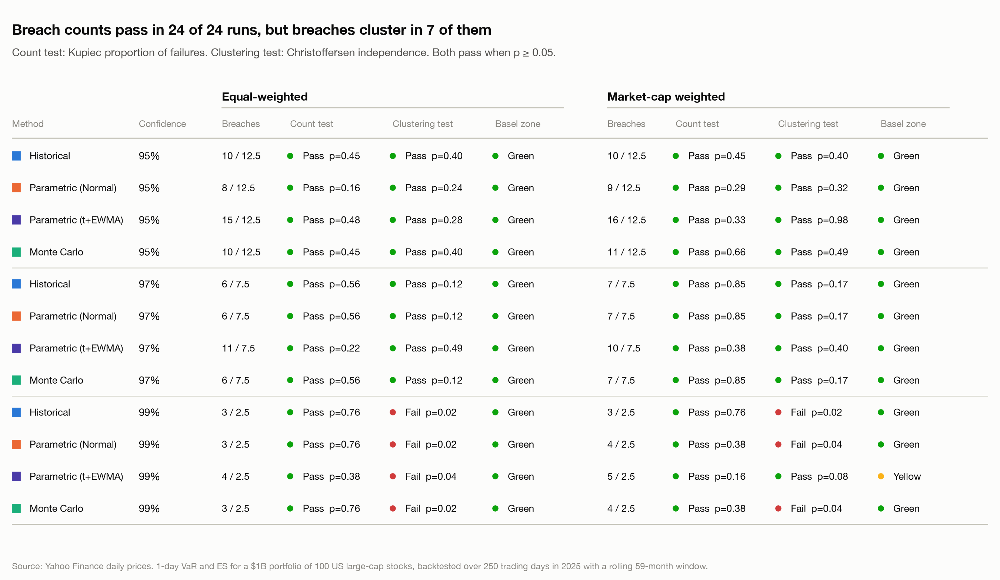
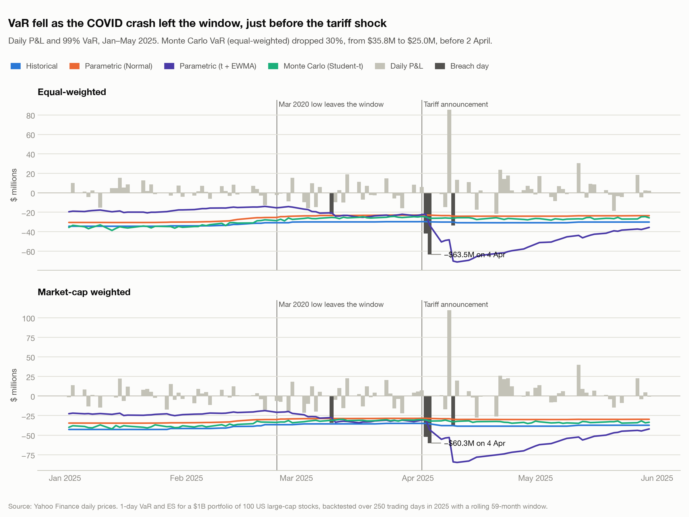
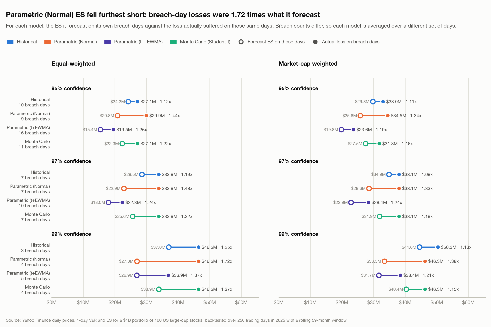
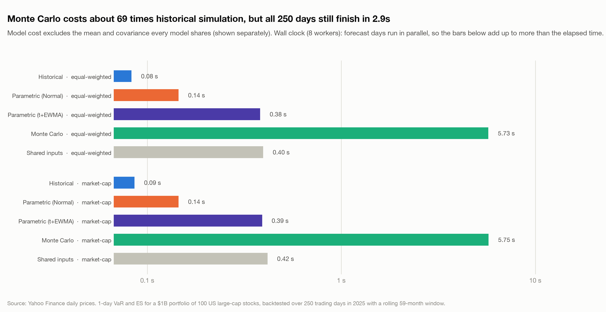

# VaR and Expected Shortfall Backtest: $1B Equity Portfolio Through the 2025 Tariff Shock

A Python risk engine that forecasts one-day **Value at Risk (VaR)** and **Expected Shortfall (ES)** for a
$1 billion portfolio of 100 US large-cap stocks, using four methods. It then backtests every
forecast against what actually happened in 2025, the year of the April tariff shock.

Each trading day in 2025, the engine:

1. Takes the previous **59 months** of daily returns, and nothing from that day or later.
2. Forecasts VaR and ES at **95%, 97% and 99%** confidence with four methods:
   - **Historical simulation**: revalue today's portfolio on every day in the window.
   - **Parametric (Normal)**: assume returns follow a normal distribution with the window's means and covariance.
   - **Parametric (t + EWMA)**: Student-t tails on an exponentially weighted volatility, in closed form.
     Recent days carry more weight, so the forecast reacts within days of a shock.
   - **Monte Carlo (Student-t)**: simulate 10,000 joint scenarios for all 100 stocks from a fat-tailed
     Student-t distribution, with its tail thickness re-fitted every day.
3. Compares the forecast with the portfolio's actual profit or loss that day and records any breach.

Over the 250 test days it then runs the standard statistical checks a risk or model-validation team would apply.

## What I changed after the first version, and why

The first working version of this project had three models: historical simulation, a parametric normal
model, and a Monte Carlo simulation with Student-t tails. Backtesting them through 2025 gave a result that
looked clean on the surface and much less clean underneath, and the two things I fixed afterwards came
straight out of that.

Every model passed the breach count test. At 99% confidence each one breached three times over 250 days
against 2.5 expected, which is exactly what you want to see, and all of them sat in the Basel Green zone.
If I had stopped at counting breaches I would have signed off on all three. The Christoffersen test is
what changed my mind. It asks whether breaches are spread out or bunched together, and for all three
models it said bunched: every 99% breach happened inside eight days in April, and the p-value came out at
0.02. A model that is right on average across a year but blind during the week that matters is not a model
I would want to defend to a risk committee.

### The parametric model was wrong in two separate ways

It helped me to separate the problem into two, because they have different fixes.

The first problem is the shape of the tail. The normal distribution says a five standard deviation day
essentially never happens. Real equity returns produce them often enough that anyone who has worked
through a crisis has seen several. My own Monte Carlo had already told me this: it was fitting Student-t
degrees of freedom of about 4 to the same data, which is a very fat tail. So the normal model was being
contradicted by another model in the same run. That showed up in the results as an Expected Shortfall of
$27.9M at 99% while the actual losses on its breach days averaged $46.5M, which is 1.72 times the
forecast.

The second problem is reaction speed, and I think it is the more serious one. With a 59-month window,
every one of roughly 1,240 days carries the same weight. When the tariff announcement hit on 2 April and
the portfolio lost $63.5M two days later, those days entered the window as two observations out of 1,240,
so the forecast barely moved. Worse, the window had been quietly getting calmer: the March 2020 COVID
crash rolled out of the 59-month window in late February 2025, and 99% VaR fell about 25% in the weeks
before the shock. The model was at its least cautious right before the worst day of the year, and nothing
about that was a modelling accident, it is what a long equally weighted window does by construction.

So I added a fourth model, `ParametricStudentTEwma` in `models.py`, that addresses both at once. Volatility
comes from an exponentially weighted moving average with a decay of 0.94, the RiskMetrics standard, which
gives a half-life of about 11 days, so a shock is reflected in the forecast within days rather than being
diluted across five years. The tail comes from a Student-t whose degrees of freedom are fitted each day
from the kurtosis of the volatility-standardised residuals, so what the t is describing is the fat tail
that remains after the change in volatility has been taken out.

I wrote it in closed form rather than by simulation, and that was a deliberate decision worth explaining.
The portfolio has fixed weights, so its return is just a weighted sum of the individual stock returns, and
a weighted sum of jointly Student-t variables is itself a univariate Student-t. In other words the
10,000-scenario simulation and a formula are answering the same question for this portfolio. The formula
takes 0.38 seconds for the year against 5.73 seconds for the simulation and gives the same answer, so for
a linear portfolio the simulation is buying nothing. I kept the Monte Carlo model anyway, because the
moment the portfolio holds options or anything path dependent, that equivalence breaks and simulation is
the only option that still works.

The results are a clear improvement on the failure I was trying to fix, and they come with a cost that I
think is worth being upfront about.

| Clustering test, p >= 0.05 passes | 95% | 97% | 99% equal | 99% market-cap |
|:--|--:|--:|--:|--:|
| Parametric (Normal) | 0.24 | 0.12 | 0.02 fail | 0.04 fail |
| Historical | 0.40 | 0.12 | 0.02 fail | 0.02 fail |
| Monte Carlo (Student-t) | 0.40 | 0.12 | 0.02 fail | 0.04 fail |
| **Parametric (t + EWMA)** | 0.28 | **0.49** | 0.043 fail | **0.08 pass** |

The clearest way to see the difference is the tariff chart in `outputs/comparison2/`. On 4 April the new
model's 99% VaR jumps from about $25M to about $70M in a single day, while the other three lines stay
almost flat through the entire episode. That is the behaviour I wanted: a risk number that tells you the
world has changed while it is changing, not two months later.

The cost is that a model which reacts upwards quickly also reacts downwards quickly. In calm periods its
VaR sits below the others, so it breaches more often when nothing much is happening: 15 breaches at 95%
against 12.5 expected, and 5 breaches at 99% in the market-cap portfolio, which is the one cell in the
whole run that lands in the Basel Yellow zone. That is a real trade-off rather than a bug. A bank running
this model would hold less capital in quiet markets and be asked more questions about small breaches, in
exchange for a number that moves when a crisis starts. I would still choose it, but I would pair it with a
stressed VaR so the capital number never drifts down as far as this one does.

It is also worth saying what it did not fix. At 99% in the equal-weighted portfolio the clustering
p-value only moved from 0.02 to 0.043, so it still fails, just less badly. Four breaches inside two weeks
is a hard pattern for any single volatility model to avoid. The next thing I would try is filtered
historical simulation, which divides past returns by the volatility of their own day, bootstraps those
standardised returns, and rescales them to today's volatility. It keeps the real shape of historical
crashes instead of assuming any distribution at all, and it inherits the same fast reaction from the EWMA.

### Monte Carlo was slow, but not for the reason I assumed

The first version took 28.6 seconds to produce the year of Monte Carlo forecasts. My assumption was that
the simulation itself was the cost, since it draws 10,000 scenarios across 100 stocks for each of 250
days. Profiling said otherwise. The dominant cost was `scipy.stats.t.fit`, the maximum likelihood fit of
the degrees of freedom, which runs a numerical optimiser over about 1,240 observations every single day.
The actual simulation was a small fraction of the total. That was a useful reminder that optimising
without measuring first usually means speeding up the wrong thing.

Three changes took it from 28.6 seconds to 2.8 seconds of wall clock for the whole backtest, all four
models included.

First, the degrees of freedom now come from the sample kurtosis rather than maximum likelihood. For a
Student-t, excess kurtosis is 6 / (df - 4), so the estimate is one line of arithmetic instead of an
optimiser. Monte Carlo dropped from 28.6 to 7.6 seconds.

Second, the four models now share their inputs. Previously each model computed its own mean and covariance
from the same window, which meant building the same 100 by 100 matrix repeatedly per day. A `WindowMoments`
object now builds it once per forecast day and hands it to every model, and the EWMA covariance is rolled
forward across the whole sample in one pass rather than being rebuilt inside each window. Monte Carlo
dropped to 5.7 seconds, and the shared inputs now cost 0.4 seconds in total for the year.

Third, the forecast days run on an 8-thread pool. Each day is independent of every other day, which makes
this the easiest kind of parallelism, but it only stays honest if the results do not change. The original
code drew from one shared random stream, so any reordering would have changed every number. Each day now
gets its own seed spawned from the master seed, which means serial and parallel runs produce identical
output, and there is a test that asserts exactly that. Wall clock for the whole loop went from 7.0 seconds
to 2.8 seconds.

The speed came with one real trade-off, and I measured it rather than assuming it away. The moment
estimator reads the tails as slightly thinner than maximum likelihood does: median degrees of freedom of
4.99 against 3.97, which lowers the 99% Monte Carlo ES from $39.5M to $36.4M. Neither version changes a
single breach count or test outcome over the 250 days, so I kept the fast estimator as the default and
left the slower one one line away in the config, as `mc_df_method = "mle"`. If I were using this to set
capital rather than to compare methods, I would run the maximum likelihood version, because on the tail
estimate I would rather be slow and right.


## Results (equal-weighted portfolio, 2025)

| Method | Confidence | Avg VaR | Avg ES | Runtime (s) | Breaches (actual / expected) | Kupiec p | Clustering p | Basel zone | Avg loss on breach days | Actual loss / ES |
|:--|:--|--:|--:|--:|:--|--:|--:|:--|--:|--:|
| Historical | 95% | $15.9M | $24.8M | 0.08 | 10 / 12.5 | 0.453 | 0.401 | Green | $27.1M | 1.12 |
| Historical | 97% | $20.0M | $29.5M | 0.08 | 6 / 7.5 | 0.565 | 0.120 | Green | $33.9M | 1.19 |
| Historical | 99% | $30.6M | $39.3M | 0.08 | 3 / 2.5 | 0.758 | **0.020** | Green | $46.5M | 1.26 |
| Parametric (Normal) | 95% | $16.9M | $21.4M | 0.15 | 8 / 12.5 | 0.163 | 0.240 | Green | $29.9M | 1.44 |
| Parametric (Normal) | 97% | $19.5M | $23.7M | 0.15 | 6 / 7.5 | 0.565 | 0.120 | Green | $33.9M | 1.49 |
| Parametric (Normal) | 99% | $24.3M | $27.9M | 0.15 | 3 / 2.5 | 0.758 | **0.020** | Green | $46.5M | **1.73** |
| Parametric (t + EWMA) | 95% | $14.4M | $19.9M | 0.38 | 15 / 12.5 | 0.481 | 0.280 | Green | $19.5M | 1.21 |
| Parametric (t + EWMA) | 97% | $17.1M | $22.7M | 0.38 | 11 / 7.5 | 0.224 | 0.494 | Green | $22.3M | 1.19 |
| Parametric (t + EWMA) | 99% | $23.1M | $29.0M | 0.38 | 4 / 2.5 | 0.380 | **0.043** | Green | $36.9M | 1.37 |
| Monte Carlo (Student-t) | 95% | $16.0M | $23.3M | 5.73 | 10 / 12.5 | 0.453 | 0.401 | Green | $27.1M | 1.22 |
| Monte Carlo (Student-t) | 97% | $19.4M | $27.2M | 5.73 | 6 / 7.5 | 0.565 | 0.120 | Green | $33.9M | 1.32 |
| Monte Carlo (Student-t) | 99% | $27.2M | $36.4M | 5.73 | 3 / 2.5 | 0.758 | **0.020** | Green | $46.5M | 1.37 |

Runtimes exclude the window mean and covariance, which every model shares, and are measured serially so
they compare like with like. All 250 days finish in **2.8 seconds** of wall clock on an 8-thread pool.
The full reports, including the market-cap-weighted run, are in
[`outputs/equal/report.md`](outputs/equal/report.md) and
[`outputs/market_cap/report.md`](outputs/market_cap/report.md).


### Comparison charts

Eight charts compare every method, confidence level and weighting scheme. See the
[full gallery](outputs/comparison2/README.md). (`outputs/comparison/` keeps the earlier
three-model version for reference.)

| | |
|:--|:--|
|  |  |
|  |  |

### How to read the columns

| Column | Meaning |
|:--|:--|
| Avg VaR / Avg ES | Average of the 250 daily forecasts |
| Breaches | Days the actual loss exceeded that day's VaR, and the number expected, e.g. 250 × 1% at 99% |
| Kupiec p | Tests whether the breach **count** fits the confidence level. Below 0.05 means it does not |
| Clustering p | Christoffersen test of whether breaches **bunch together**. Below 0.05 means they do |
| Basel zone | Regulatory traffic light: Green is acceptable; Yellow and Red mean too many breaches |
| Avg loss on breach days | The realised shortfall: the average actual loss when VaR was breached |
| Avg ES on breach days | The ES forecast on those same days (in `summary.csv`). Comparing this with the line above is like-for-like; comparing against Avg ES is not, because Avg ES includes quiet days |
| Actual loss / ES | On breach days, the actual loss divided by the ES forecast. Above 1 means ES understated the loss |

## Key findings

1. **Counting breaches alone would pass every model.** All 24 model and confidence combinations have
   statistically acceptable breach counts, and all but one are in the Basel Green zone. A backtest that
   stopped there would approve every model.
2. **The timing of the breaches is what separates them.** With a 59-month window, the three slow-moving
   models breached three times at 99% within 8 days (3, 4 and 10 April) and the Christoffersen test
   rejects independence (p = 0.02) for all of them.
3. **A reacting model fixes most of that.** t + EWMA raises the clustering p-value at every level, and in
   the market-cap portfolio it is the **only model that passes at 99%** (p = 0.08). Its 99% VaR jumps from
   about $25M to $70M on 4 April while the other three barely move.
4. **Reacting has a price.** It breaches more often in calm markets: 15 at 95% against 12.5 expected, and
   5 at 99% market-cap, the one cell in the Yellow zone. Both points are covered in detail above.
5. **The normal distribution still understates tail losses the most.** On breach days, actual losses were
   **1.72×** the ES forecast for the normal model, against 1.37× for t + EWMA and Monte Carlo, and 1.25×
   for historical simulation.
6. **Market-cap weighting raises risk.** The top 5 names make up 39% of the portfolio, and 99% historical
   VaR rises from $30.6M to $37.0M.

**What I would do next:** filtered historical simulation, and a stressed VaR computed on the March 2020
crash so a crisis never simply drops out of the risk measure. My reasoning for both is in the section
above.

## Performance

The numbers behind the optimisation described above. Every change was verified against the committed
results, and a test asserts that running in parallel reproduces the serial output exactly.

| Change | Effect |
|:--|:--|
| Degrees of freedom from sample kurtosis instead of maximum likelihood | Monte Carlo 28.6s → 7.6s |
| One shared mean and covariance per day instead of one per model | Monte Carlo 7.6s → 5.7s; shared inputs cost 0.4s in total |
| EWMA covariance rolled forward once for the whole run | 250 recursions replaced by one pass |
| Forecast days spread over an 8-thread pool | Whole loop 7.0s → **2.8s** wall clock |

Overall the backtest went from about 29 seconds to 2.8 seconds, roughly **10× faster**, with identical
breach counts and test outcomes.

The moment-based estimator's trade-off, measured:

| Degrees of freedom | Runtime | Median df | 99% ES | Actual loss / ES |
|:--|--:|--:|--:|--:|
| Moments (default) | 7.6s | 4.99 | $36.4M | 1.37 |
| Maximum likelihood | 28.1s | 3.97 | $39.5M | 1.31 |

Both give the same breach count; `mc_df_method = "mle"` in `config.toml` switches back.

## Methodology and assumptions

| Topic | Choice | Why |
|:--|:--|:--|
| Data | Yahoo Finance daily prices, Jan 2020 to Dec 2025 (5 years of history + 2025 test year) | Free and reproducible; cached with SHA-256 hashes |
| Universe | First 100 candidates, in order of market cap on 31 Dec 2024, that pass data checks | Uses only information available before the test year |
| Returns | Simple daily returns on dividend-adjusted prices | With fixed weights, portfolio return is exactly the weighted sum of stock returns |
| Weights | Equal, or market cap = shares outstanding × close on 31 Dec 2024; held fixed through 2025 | Historical share counts avoid using today's market caps (look-ahead bias) |
| Horizon | 1 day, in dollars on $1B | Standard for trading-book VaR backtesting |
| Window | Rolling 59 months, strictly before the forecast date | Unit test confirms a test-day shock cannot change that day's forecast |
| Monte Carlo | 10,000 multivariate Student-t scenarios per day; degrees of freedom fitted from sample kurtosis each day, bounded to [3, 30] | Keeps the sample covariance while adding fat tails |
| EWMA | RiskMetrics decay of 0.94 (about an 11-day half-life), rolled forward across the whole sample | Standard market-risk setting; each day reads the state before its own return, so no look-ahead |
| Student-t VaR/ES | Closed form, with the t rescaled so its standard deviation matches the EWMA volatility | A linear portfolio of multivariate-t assets is itself univariate t, so simulation is unnecessary here |
| Reproducibility | One seed per forecast day, derived from the master seed | Results are identical serially or on any number of threads (asserted by a test) |
| Basel zones | Basel's 95% / 99.99% cumulative-probability cut-offs, applied to all three confidence levels | Basel defines zones for 99% only; this extends the same rule |

### Known limitations

- **Survivorship bias:** the universe only includes companies that still existed in 2024.
- **Daily rebalancing:** fixed weights mean the portfolio is rebalanced daily with no trading costs.
- **Share counts:** FISV and MRSH had no historical share count, so today's count was used and the run logs it.
- **Only 250 test days:** tests at 99% have little power, since only 2.5 breaches are expected.
- **Flagged large moves:** the data check flags daily moves above 25%. All 9 were checked against their
  dates and kept as genuine: earnings reactions (e.g. ORCL +36% on 10 Sep 2025, FISV −44% on 29 Oct 2025,
  NFLX −35% on 20 Apr 2022) and COVID rebounds (UBER, COP in March 2020).

## Built for review: controls and audit trail

- **Reproducible data:** prices are cached with a manifest (source, download time, SHA-256 hash). A run fails if cached data has been altered.
- **Data-quality report:** `data_quality.csv` lists every candidate as included, dropped (with reason) or flagged, and the run logs each case.
- **Exceptions report:** `exceptions.csv` lists every breach, with the VaR, the actual loss and the amount over the limit.
- **Run log:** each run writes a timestamped log to `logs/`, including the full configuration used.
- **Configuration, not code changes:** AUM, dates, window, confidence levels and simulation settings live in `config.toml`.
- **Tests:** 38 unit tests cover known answers for each model, the closed-form Student-t against simulation, the EWMA recursion, the Basel zone table, both statistical tests, a no-look-ahead check, and proof that threading changes no result.

## Running it

```bash
python -m venv .venv && source .venv/bin/activate
pip install -e ".[dev]"

python -m var_backtest --weighting equal         # or market_cap
python -m var_backtest --refresh-data            # re-download instead of using the cache
python -m var_backtest --workers 8              # spread forecast days over 8 threads
python -m var_backtest.compare --out comparison2  # comparison charts from saved outputs
pytest
```

Outputs go to `outputs/<weighting>/`:

| File | Contents |
|:--|:--|
| `report.md` | Summary table, monthly breaches, worst days, weights, data quality |
| `summary.csv` | The results table, unformatted |
| `daily_forecasts.csv` | Every forecast: date, method, confidence, VaR, ES, actual P&L, breach flag |
| `exceptions.csv` | Breach days only |
| `monthly_breaches.csv` | Breaches by month, method and confidence |
| `weights.csv`, `data_quality.csv`, `fitted_parameters.csv` | Inputs and per-day fitted parameters |
| `compute_profile.csv` | Time per model, the shared inputs, and wall clock |
| `charts/var_backtest.png` | Daily P&L against each method's VaR |

`python -m var_backtest.compare` writes 8 comparison charts and a gallery page to `outputs/comparison/`.

## Project structure

```
config.toml              run settings and the candidate stock list
src/var_backtest/
  config.py              load and validate settings
  data.py                download, cache, hash and quality-check prices
  weights.py             equal and market-cap weights
  models.py              the four VaR/ES models, shared window moments and EWMA covariance
  stats.py               Kupiec, Christoffersen and Basel traffic-light tests
  backtest.py            rolling-window engine and summaries
  report.py              CSV, Markdown and chart outputs
  compare.py             comparison charts across methods and weightings
  style.py               shared chart palette and styling
  cli.py                 command-line entry point
tests/                   unit tests
```
