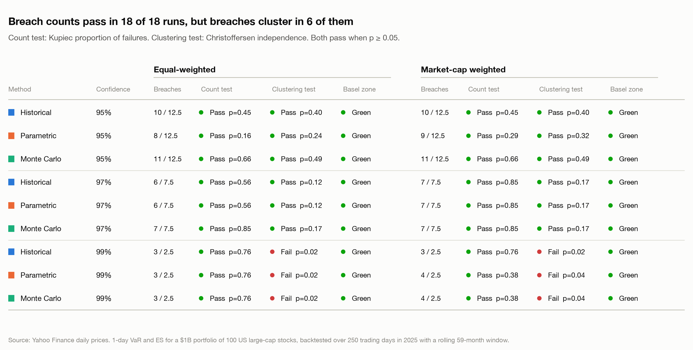
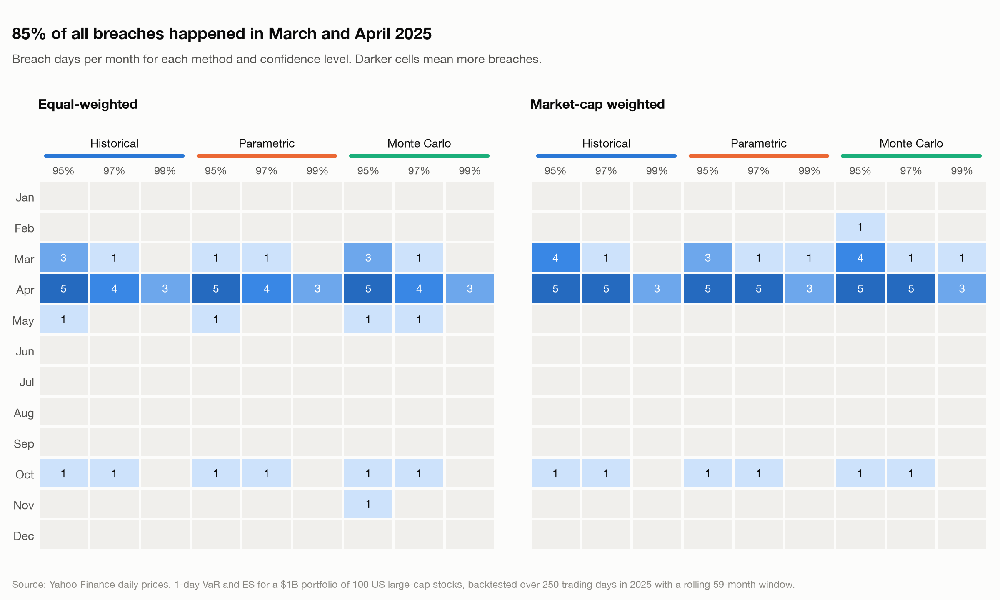
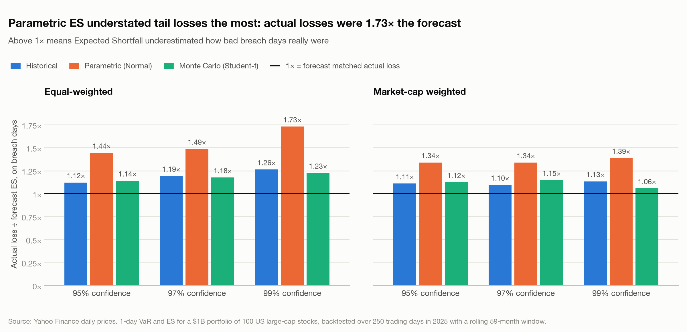
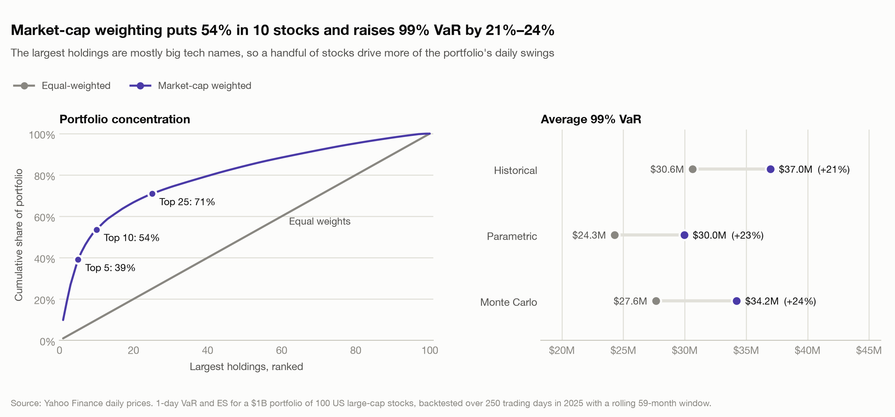

# VaR and Expected Shortfall Backtest: $1B Equity Portfolio Through the 2025 Tariff Shock

A Python risk engine that forecasts one-day **Value at Risk (VaR)** and **Expected Shortfall (ES)** for a
$1 billion portfolio of 100 US large-cap stocks, using three methods. It then backtests every
forecast against what actually happened in 2025, the year of the April tariff shock.

Each trading day in 2025, the engine:

1. Takes the previous **59 months** of daily returns, and nothing from that day or later.
2. Forecasts VaR and ES at **95%, 97% and 99%** confidence with three methods:
   - **Historical simulation**: revalue today's portfolio on every day in the window.
   - **Parametric (Normal)**: assume returns follow a normal distribution with the window's means and covariance.
   - **Monte Carlo (Student-t)**: simulate 10,000 joint scenarios for all 100 stocks from a fat-tailed
     Student-t distribution, with its tail thickness re-fitted every day.
3. Compares the forecast with the portfolio's actual profit or loss that day and records any breach.

Over the 250 test days it then runs the standard statistical checks a risk or model-validation team would apply.

## Results (equal-weighted portfolio, 2025)

| Method | Confidence | Avg VaR | Avg ES | Runtime (s) | Breaches (actual / expected) | Kupiec p | Clustering p | Basel zone | Avg loss on breach days | Actual loss / ES |
|:--|:--|--:|--:|--:|:--|--:|--:|:--|--:|--:|
| Historical | 95% | $15.9M | $24.8M | 0.12 | 10 / 12.5 | 0.453 | 0.401 | Green | $27.1M | 1.12 |
| Historical | 97% | $20.0M | $29.5M | 0.12 | 6 / 7.5 | 0.565 | 0.120 | Green | $33.9M | 1.19 |
| Historical | 99% | $30.6M | $39.3M | 0.12 | 3 / 2.5 | 0.758 | **0.020** | Green | $46.5M | 1.26 |
| Parametric (Normal) | 95% | $16.9M | $21.4M | 0.43 | 8 / 12.5 | 0.163 | 0.240 | Green | $29.9M | 1.44 |
| Parametric (Normal) | 97% | $19.5M | $23.7M | 0.43 | 6 / 7.5 | 0.565 | 0.120 | Green | $33.9M | 1.49 |
| Parametric (Normal) | 99% | $24.3M | $27.9M | 0.43 | 3 / 2.5 | 0.758 | **0.020** | Green | $46.5M | **1.73** |
| Monte Carlo (Student-t) | 95% | $15.2M | $23.5M | 28.23 | 11 / 12.5 | 0.657 | 0.494 | Green | $26.0M | 1.14 |
| Monte Carlo (Student-t) | 97% | $18.7M | $28.1M | 28.23 | 7 / 7.5 | 0.851 | 0.174 | Green | $31.7M | 1.18 |
| Monte Carlo (Student-t) | 99% | $27.6M | $39.6M | 28.23 | 3 / 2.5 | 0.758 | **0.020** | Green | $46.5M | 1.23 |

Runtimes are from one run on a laptop and will vary. The full reports, including the market-cap-weighted
run, are in [`outputs/equal/report.md`](outputs/equal/report.md) and
[`outputs/market_cap/report.md`](outputs/market_cap/report.md).


### Comparison charts

Eight charts compare every method, confidence level and weighting scheme. See the
[full gallery](outputs/comparison/README.md).

| | |
|:--|:--|
|  |  |
|  |  |

### How to read the columns

| Column | Meaning |
|:--|:--|
| Avg VaR / Avg ES | Average of the 250 daily forecasts |
| Breaches | Days the actual loss exceeded that day's VaR, and the number expected, e.g. 250 × 1% at 99% |
| Kupiec p | Tests whether the breach **count** fits the confidence level. Below 0.05 means it does not |
| Clustering p | Christoffersen test of whether breaches **bunch together**. Below 0.05 means they do |
| Basel zone | Regulatory traffic light: Green is acceptable; Yellow and Red mean too many breaches |
| Avg loss on breach days | The realised shortfall: the average actual loss when VaR was breached |
| Actual loss / ES | On breach days, the actual loss divided by the ES forecast. Above 1 means ES understated the loss |

## Key findings

1. **Counting breaches alone would pass every model.** All 9 model and confidence combinations are in the
   Basel Green zone, and every breach count is statistically acceptable. A backtest that stopped there
   would approve all three models.
2. **The timing of the breaches tells a different story.** All three 99% breaches fell within
   8 days (3, 4 and 10 April 2025), and the Christoffersen test rejects "breaches are independent"
   (p = 0.02) for every method. The forecasts barely moved during the shock: a 59-month window gives one
   crisis day too little weight to react.
3. **The COVID crash left the window just before the tariff shock.** Between 2 January and 1 April 2025,
   99% VaR fell by 25% (Parametric, $30.7M to $23.1M), 22% (Monte Carlo) and 14% (Historical). This
   happened as March 2020 dropped out of the 59-month window. The models were at their least cautious
   right before the largest loss of the year: **−$63.5M on 4 April**.
4. **The normal distribution understates tail losses.** At 99%, parametric ES averaged $27.9M,
   against $39.3M for historical simulation. On breach days the actual loss was **1.73×** the parametric ES
   forecast, versus 1.23× for Monte Carlo (Student-t) and 1.26× for historical simulation. The fitted
   Student-t degrees of freedom had a median of 4.0, meaning very fat tails.
5. **Market-cap weighting raises risk.** The top 5 names (AAPL, NVDA, MSFT, GOOGL, AMZN) make up 39% of
   the portfolio, and 99% historical VaR rises from $30.6M to $37.0M. At 99%, Monte Carlo's ES was the
   closest to actual losses (1.06×).
6. **Speed versus accuracy.** Historical simulation and the parametric method cost well under a second
   for the whole year. Monte Carlo costs about 25–28 seconds, and at 99% it gave ES estimates as good as
   historical simulation without depending on which crisis days happen to be in the window.

**What I would do next:** give recent days more weight (e.g. EWMA volatility or filtered historical
simulation) so VaR reacts within days of a shock, and add a stressed VaR computed on the March 2020 crash
so a crisis never simply drops out of the risk measure.

## Methodology and assumptions

| Topic | Choice | Why |
|:--|:--|:--|
| Data | Yahoo Finance daily prices, Jan 2020 to Dec 2025 (5 years of history + 2025 test year) | Free and reproducible; cached with SHA-256 hashes |
| Universe | First 100 candidates, in order of market cap on 31 Dec 2024, that pass data checks | Uses only information available before the test year |
| Returns | Simple daily returns on dividend-adjusted prices | With fixed weights, portfolio return is exactly the weighted sum of stock returns |
| Weights | Equal, or market cap = shares outstanding × close on 31 Dec 2024; held fixed through 2025 | Historical share counts avoid using today's market caps (look-ahead bias) |
| Horizon | 1 day, in dollars on $1B | Standard for trading-book VaR backtesting |
| Window | Rolling 59 months, strictly before the forecast date | Unit test confirms a test-day shock cannot change that day's forecast |
| Monte Carlo | 10,000 multivariate Student-t scenarios per day, seed 42; degrees of freedom fitted by maximum likelihood each day, bounded to [3, 30] | Reproducible; keeps the sample covariance while adding fat tails |
| Basel zones | Basel's 95% / 99.99% cumulative-probability cut-offs, applied to all three confidence levels | Basel defines zones for 99% only; this extends the same rule |

### Known limitations

- **Survivorship bias:** the universe only includes companies that still existed in 2024.
- **Daily rebalancing:** fixed weights mean the portfolio is rebalanced daily with no trading costs.
- **Share counts:** FISV and MRSH had no historical share count, so today's count was used and the run logs it.
- **Only 250 test days:** tests at 99% have little power, since only 2.5 breaches are expected.
- **Flagged large moves:** the data check flags daily moves above 25%. All 9 were checked against their
  dates and kept as genuine: earnings reactions (e.g. ORCL +36% on 10 Sep 2025, FISV −44% on 29 Oct 2025,
  NFLX −35% on 20 Apr 2022) and COVID rebounds (UBER, COP in March 2020).

## Built for review: controls and audit trail

- **Reproducible data:** prices are cached with a manifest (source, download time, SHA-256 hash). A run fails if cached data has been altered.
- **Data-quality report:** `data_quality.csv` lists every candidate as included, dropped (with reason) or flagged, and the run logs each case.
- **Exceptions report:** `exceptions.csv` lists every breach, with the VaR, the actual loss and the amount over the limit.
- **Run log:** each run writes a timestamped log to `logs/`, including the full configuration used.
- **Configuration, not code changes:** AUM, dates, window, confidence levels and simulation settings live in `config.toml`.
- **Tests:** 22 unit tests cover known answers for each model, the Basel zone table, both statistical tests and a no-look-ahead check.

## Running it

```bash
python -m venv .venv && source .venv/bin/activate
pip install -e ".[dev]"

python -m var_backtest --weighting equal         # or market_cap
python -m var_backtest --refresh-data            # re-download instead of using the cache
python -m var_backtest.compare                  # comparison charts from saved outputs
pytest
```

Outputs go to `outputs/<weighting>/`:

| File | Contents |
|:--|:--|
| `report.md` | Summary table, monthly breaches, worst days, weights, data quality |
| `summary.csv` | The results table, unformatted |
| `daily_forecasts.csv` | Every forecast: date, method, confidence, VaR, ES, actual P&L, breach flag |
| `exceptions.csv` | Breach days only |
| `monthly_breaches.csv` | Breaches by month, method and confidence |
| `weights.csv`, `data_quality.csv`, `student_t_df.csv` | Inputs and fitted parameters |
| `charts/var_backtest.png` | Daily P&L against each method's VaR |

`python -m var_backtest.compare` writes 8 comparison charts and a gallery page to `outputs/comparison/`.

## Project structure

```
config.toml              run settings and the candidate stock list
src/var_backtest/
  config.py              load and validate settings
  data.py                download, cache, hash and quality-check prices
  weights.py             equal and market-cap weights
  models.py              historical, parametric and Monte Carlo VaR/ES
  stats.py               Kupiec, Christoffersen and Basel traffic-light tests
  backtest.py            rolling-window engine and summaries
  report.py              CSV, Markdown and chart outputs
  compare.py             comparison charts across methods and weightings
  style.py               shared chart palette and styling
  cli.py                 command-line entry point
tests/                   unit tests
```
