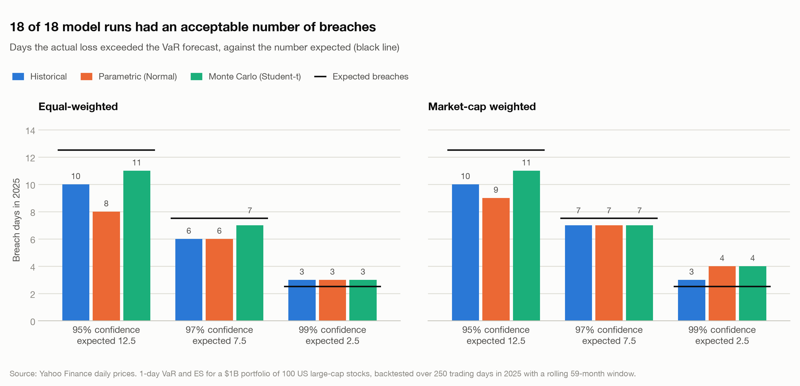
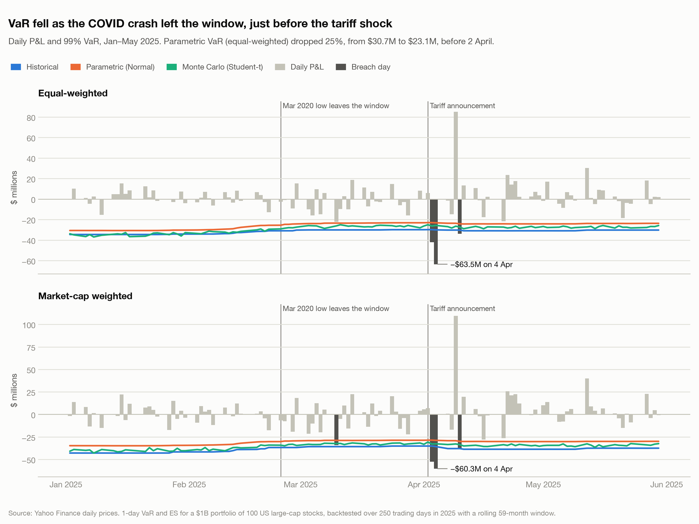
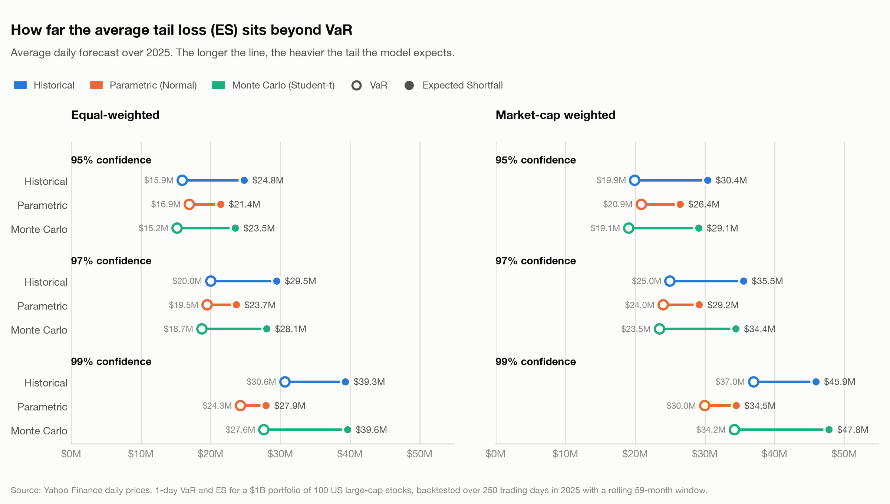
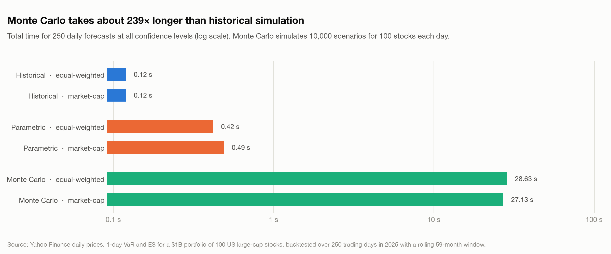

# Comparison charts

Generated from `outputs/` by `python -m var_backtest.compare`.

## Breach counts

Did each model breach about as often as its confidence level implies?

## Backtest scorecard

Count test, clustering test and Basel zone for every run.

## When breaches happened

Breaches by month show how tightly they bunch around the tariff shock.

## The tariff shock, up close

VaR drifted down as March 2020 left the window, just before the April losses.

## VaR vs Expected Shortfall

How much further the average tail loss sits beyond VaR, per model.

## Was ES big enough?

Average actual loss on breach days, and how it compares with the ES forecast.

## Equal vs market-cap weights

Concentration in mega-caps and its effect on VaR.

## Speed

Compute cost of each method.

