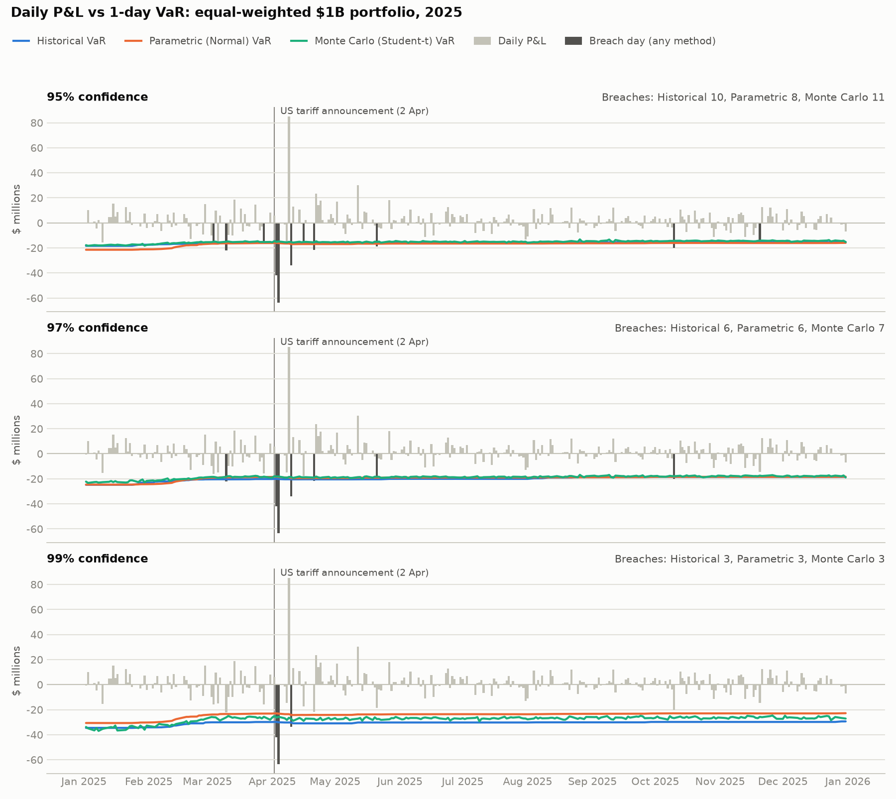

# VaR and Expected Shortfall backtest: equal weighted

Generated 2026-09-17 22:41. Portfolio $1B, 100 US large-cap stocks, 1-day horizon.
Test period 02 Jan 2025 to 31 Dec 2025 (250 trading days). Each day's forecast uses the previous 59 months only (first window: 03 Feb 2020, 1237 days).

## Results

| Method                  | Confidence   | Avg VaR   | Avg ES   |   Runtime (s) | Breaches (actual / expected)   |   Kupiec p | Count OK?   |   Clustering p | Basel zone   | Avg loss on breach days   |   Actual loss / ES |
|:------------------------|:-------------|:----------|:---------|--------------:|:-------------------------------|-----------:|:------------|---------------:|:-------------|:--------------------------|-------------------:|
| Historical              | 95%          | $15.9M    | $24.8M   |          0.12 | 10 / 12.5                      |      0.453 | Yes         |          0.401 | Green        | $27.1M                    |               1.12 |
| Historical              | 97%          | $20.0M    | $29.5M   |          0.12 | 6 / 7.5                        |      0.565 | Yes         |          0.12  | Green        | $33.9M                    |               1.19 |
| Historical              | 99%          | $30.6M    | $39.3M   |          0.12 | 3 / 2.5                        |      0.758 | Yes         |          0.02  | Green        | $46.5M                    |               1.26 |
| Parametric (Normal)     | 95%          | $16.9M    | $21.4M   |          0.42 | 8 / 12.5                       |      0.163 | Yes         |          0.24  | Green        | $29.9M                    |               1.44 |
| Parametric (Normal)     | 97%          | $19.5M    | $23.7M   |          0.42 | 6 / 7.5                        |      0.565 | Yes         |          0.12  | Green        | $33.9M                    |               1.49 |
| Parametric (Normal)     | 99%          | $24.3M    | $27.9M   |          0.42 | 3 / 2.5                        |      0.758 | Yes         |          0.02  | Green        | $46.5M                    |               1.73 |
| Monte Carlo (Student-t) | 95%          | $15.2M    | $23.5M   |         28.63 | 11 / 12.5                      |      0.657 | Yes         |          0.494 | Green        | $26.0M                    |               1.14 |
| Monte Carlo (Student-t) | 97%          | $18.7M    | $28.1M   |         28.63 | 7 / 7.5                        |      0.851 | Yes         |          0.174 | Green        | $31.7M                    |               1.18 |
| Monte Carlo (Student-t) | 99%          | $27.6M    | $39.6M   |         28.63 | 3 / 2.5                        |      0.758 | Yes         |          0.02  | Green        | $46.5M                    |               1.23 |

How to read this table:
- **Avg VaR / Avg ES**: the average of the daily forecasts over the test year.
- **Kupiec p**: tests whether the breach count fits the confidence level. Below 0.05 means it does not.
- **Clustering p**: Christoffersen test. Below 0.05 means breaches bunch together instead of being spread out.
- **Basel zone**: Green is acceptable; Yellow and Red mean too many breaches.
- **Actual loss / ES**: on breach days, the actual loss divided by that day's ES forecast, averaged. Above 1 means ES understated the loss.
- **Avg ES** above is averaged over all test days. `summary.csv` also carries *Avg ES on breach days*, the average ES forecast on the breach days only, which is the like-for-like comparison against the realised loss.
- **Runtime**: total time for all 250 daily forecasts (Monte Carlo uses 10,000 scenarios per day).

## Breaches by month

| month   |   Historical 95% |   Historical 97% |   Historical 99% |   Parametric (Normal) 95% |   Parametric (Normal) 97% |   Parametric (Normal) 99% |   Monte Carlo (Student-t) 95% |   Monte Carlo (Student-t) 97% |   Monte Carlo (Student-t) 99% |
|:--------|-----------------:|-----------------:|-----------------:|--------------------------:|--------------------------:|--------------------------:|------------------------------:|------------------------------:|------------------------------:|
| 2025-01 |                0 |                0 |                0 |                         0 |                         0 |                         0 |                             0 |                             0 |                             0 |
| 2025-02 |                0 |                0 |                0 |                         0 |                         0 |                         0 |                             0 |                             0 |                             0 |
| 2025-03 |                3 |                1 |                0 |                         1 |                         1 |                         0 |                             3 |                             1 |                             0 |
| 2025-04 |                5 |                4 |                3 |                         5 |                         4 |                         3 |                             5 |                             4 |                             3 |
| 2025-05 |                1 |                0 |                0 |                         1 |                         0 |                         0 |                             1 |                             1 |                             0 |
| 2025-06 |                0 |                0 |                0 |                         0 |                         0 |                         0 |                             0 |                             0 |                             0 |
| 2025-07 |                0 |                0 |                0 |                         0 |                         0 |                         0 |                             0 |                             0 |                             0 |
| 2025-08 |                0 |                0 |                0 |                         0 |                         0 |                         0 |                             0 |                             0 |                             0 |
| 2025-09 |                0 |                0 |                0 |                         0 |                         0 |                         0 |                             0 |                             0 |                             0 |
| 2025-10 |                1 |                1 |                0 |                         1 |                         1 |                         0 |                             1 |                             1 |                             0 |
| 2025-11 |                0 |                0 |                0 |                         0 |                         0 |                         0 |                             1 |                             0 |                             0 |
| 2025-12 |                0 |                0 |                0 |                         0 |                         0 |                         0 |                             0 |                             0 |                             0 |

## Worst days for the portfolio

| Date        | P&L     |
|:------------|:--------|
| 04 Apr 2025 | $-63.5M |
| 03 Apr 2025 | $-42.0M |
| 10 Apr 2025 | $-33.9M |
| 10 Mar 2025 | $-22.1M |
| 21 Apr 2025 | $-21.7M |

Every breach is listed in `exceptions.csv` (57 rows across all methods and confidence levels).

## Monte Carlo tail thickness

Fitted Student-t degrees of freedom: median 4.0, range 3.0 to 4.7. Lower values mean more extreme days.

## Portfolio

Top 10 weights:

| Ticker   | Weight   |
|:---------|:---------|
| AAPL     | 1.00%    |
| NVDA     | 1.00%    |
| MSFT     | 1.00%    |
| AMZN     | 1.00%    |
| GOOGL    | 1.00%    |
| META     | 1.00%    |
| TSLA     | 1.00%    |
| AVGO     | 1.00%    |
| BRK-B    | 1.00%    |
| WMT      | 1.00%    |

## Data quality

- Candidates checked: 102; included: 100; dropped: 2.
- Dropped **PLTR**: insufficient history (first price 2020-09-30)
- Dropped **GEV**: insufficient history (first price 2024-03-27)
- Flagged **META**: daily move above 25% - verify corporate actions (max move 26.4%)
- Flagged **ORCL**: daily move above 25% - verify corporate actions (max move 35.9%)
- Flagged **NFLX**: daily move above 25% - verify corporate actions (max move 35.1%)
- Flagged **CRM**: daily move above 25% - verify corporate actions (max move 26.0%)
- Flagged **UBER**: daily move above 25% - verify corporate actions (max move 38.3%)
- Flagged **COP**: daily move above 25% - verify corporate actions (max move 25.2%)
- Flagged **FISV**: daily move above 25% - verify corporate actions (max move 44.0%)
- Flagged **PANW**: daily move above 25% - verify corporate actions (max move 28.4%)
- Flagged **INTC**: daily move above 25% - verify corporate actions (max move 26.1%)
- Forward-filled missing prices: 1 stock-days.
