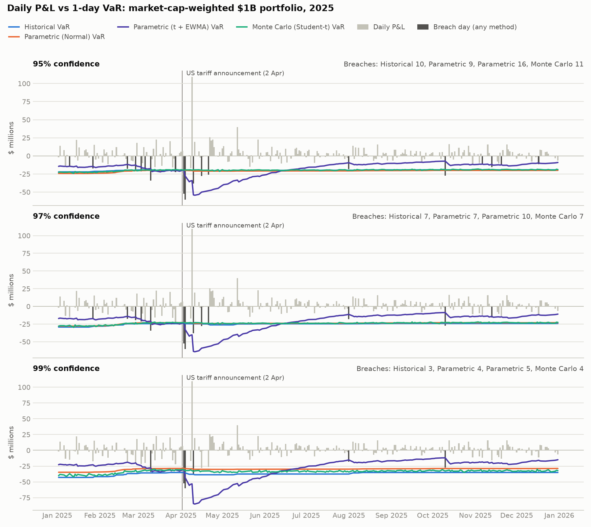

# VaR and Expected Shortfall backtest: market-cap weighted

Generated 2026-09-17 22:41. Portfolio $1B, 100 US large-cap stocks, 1-day horizon.
Test period 02 Jan 2025 to 31 Dec 2025 (250 trading days). Each day's forecast uses the previous 59 months only (first window: 03 Feb 2020, 1237 days).

## Results

| Method                  | Confidence   | Avg VaR   | Avg ES   |   Runtime (s) | Breaches (actual / expected)   |   Kupiec p | Count OK?   |   Clustering p | Basel zone   | Avg loss on breach days   |   Actual loss / ES |
|:------------------------|:-------------|:----------|:---------|--------------:|:-------------------------------|-----------:|:------------|---------------:|:-------------|:--------------------------|-------------------:|
| Historical              | 95%          | $19.9M    | $30.4M   |          0.12 | 10 / 12.5                      |      0.453 | Yes         |          0.401 | Green        | $33.0M                    |               1.11 |
| Historical              | 97%          | $25.0M    | $35.5M   |          0.12 | 7 / 7.5                        |      0.851 | Yes         |          0.174 | Green        | $38.1M                    |               1.1  |
| Historical              | 99%          | $37.0M    | $45.9M   |          0.12 | 3 / 2.5                        |      0.758 | Yes         |          0.02  | Green        | $50.3M                    |               1.13 |
| Parametric (Normal)     | 95%          | $20.9M    | $26.4M   |          0.49 | 9 / 12.5                       |      0.286 | Yes         |          0.316 | Green        | $34.5M                    |               1.34 |
| Parametric (Normal)     | 97%          | $24.0M    | $29.2M   |          0.49 | 7 / 7.5                        |      0.851 | Yes         |          0.174 | Green        | $38.1M                    |               1.34 |
| Parametric (Normal)     | 99%          | $30.0M    | $34.5M   |          0.49 | 4 / 2.5                        |      0.38  | Yes         |          0.043 | Green        | $46.3M                    |               1.39 |
| Monte Carlo (Student-t) | 95%          | $19.1M    | $29.1M   |         27.13 | 11 / 12.5                      |      0.657 | Yes         |          0.494 | Green        | $31.8M                    |               1.12 |
| Monte Carlo (Student-t) | 97%          | $23.5M    | $34.4M   |         27.13 | 7 / 7.5                        |      0.851 | Yes         |          0.174 | Green        | $38.1M                    |               1.15 |
| Monte Carlo (Student-t) | 99%          | $34.2M    | $47.8M   |         27.13 | 4 / 2.5                        |      0.38  | Yes         |          0.043 | Green        | $46.3M                    |               1.06 |

How to read this table:
- **Avg VaR / Avg ES**: the average of the daily forecasts over the test year.
- **Kupiec p**: tests whether the breach count fits the confidence level. Below 0.05 means it does not.
- **Clustering p**: Christoffersen test. Below 0.05 means breaches bunch together instead of being spread out.
- **Basel zone**: Green is acceptable; Yellow and Red mean too many breaches.
- **Actual loss / ES**: on breach days, the actual loss divided by that day's ES forecast, averaged. Above 1 means ES understated the loss.
- **Avg ES** above is averaged over all test days. `summary.csv` also carries *Avg ES on breach days*, the average ES forecast on the breach days only, which is the like-for-like comparison against the realised loss.
- **Runtime**: total time for all 250 daily forecasts (Monte Carlo uses 10,000 scenarios per day).

## Breaches by month

| month   |   Historical 95% |   Historical 97% |   Historical 99% |   Parametric (Normal) 95% |   Parametric (Normal) 97% |   Parametric (Normal) 99% |   Monte Carlo (Student-t) 95% |   Monte Carlo (Student-t) 97% |   Monte Carlo (Student-t) 99% |
|:--------|-----------------:|-----------------:|-----------------:|--------------------------:|--------------------------:|--------------------------:|------------------------------:|------------------------------:|------------------------------:|
| 2025-01 |                0 |                0 |                0 |                         0 |                         0 |                         0 |                             0 |                             0 |                             0 |
| 2025-02 |                0 |                0 |                0 |                         0 |                         0 |                         0 |                             1 |                             0 |                             0 |
| 2025-03 |                4 |                1 |                0 |                         3 |                         1 |                         1 |                             4 |                             1 |                             1 |
| 2025-04 |                5 |                5 |                3 |                         5 |                         5 |                         3 |                             5 |                             5 |                             3 |
| 2025-05 |                0 |                0 |                0 |                         0 |                         0 |                         0 |                             0 |                             0 |                             0 |
| 2025-06 |                0 |                0 |                0 |                         0 |                         0 |                         0 |                             0 |                             0 |                             0 |
| 2025-07 |                0 |                0 |                0 |                         0 |                         0 |                         0 |                             0 |                             0 |                             0 |
| 2025-08 |                0 |                0 |                0 |                         0 |                         0 |                         0 |                             0 |                             0 |                             0 |
| 2025-09 |                0 |                0 |                0 |                         0 |                         0 |                         0 |                             0 |                             0 |                             0 |
| 2025-10 |                1 |                1 |                0 |                         1 |                         1 |                         0 |                             1 |                             1 |                             0 |
| 2025-11 |                0 |                0 |                0 |                         0 |                         0 |                         0 |                             0 |                             0 |                             0 |
| 2025-12 |                0 |                0 |                0 |                         0 |                         0 |                         0 |                             0 |                             0 |                             0 |

## Worst days for the portfolio

| Date        | P&L     |
|:------------|:--------|
| 04 Apr 2025 | $-60.3M |
| 03 Apr 2025 | $-52.5M |
| 10 Apr 2025 | $-38.3M |
| 10 Mar 2025 | $-34.2M |
| 16 Apr 2025 | $-27.8M |

Every breach is listed in `exceptions.csv` (62 rows across all methods and confidence levels).

## Monte Carlo tail thickness

Fitted Student-t degrees of freedom: median 4.1, range 3.2 to 5.2. Lower values mean more extreme days.

## Portfolio

Top 10 weights:

| Ticker   | Weight   |
|:---------|:---------|
| AAPL     | 9.88%    |
| NVDA     | 8.91%    |
| MSFT     | 8.18%    |
| GOOGL    | 6.06%    |
| AMZN     | 6.02%    |
| META     | 3.86%    |
| TSLA     | 3.38%    |
| AVGO     | 2.84%    |
| BRK-B    | 2.55%    |
| WMT      | 1.91%    |

## Data quality

- Candidates checked: 102; included: 100; dropped: 2.
- Dropped **PLTR**: insufficient history (first price 2020-09-30)
- Dropped **GEV**: insufficient history (first price 2024-03-27)
- Flagged **META**: daily move above 25% - verify corporate actions (max move 26.4%)
- Flagged **ORCL**: daily move above 25% - verify corporate actions (max move 35.9%)
- Flagged **NFLX**: daily move above 25% - verify corporate actions (max move 35.1%)
- Flagged **CRM**: daily move above 25% - verify corporate actions (max move 26.0%)
- Flagged **UBER**: daily move above 25% - verify corporate actions (max move 38.3%)
- Flagged **COP**: daily move above 25% - verify corporate actions (max move 25.2%)
- Flagged **FISV**: daily move above 25% - verify corporate actions (max move 44.0%)
- Flagged **PANW**: daily move above 25% - verify corporate actions (max move 28.4%)
- Flagged **INTC**: daily move above 25% - verify corporate actions (max move 26.1%)
- Forward-filled missing prices: 1 stock-days.

- Share counts from current data instead of history: 2 tickers (FISV, MRSH)
